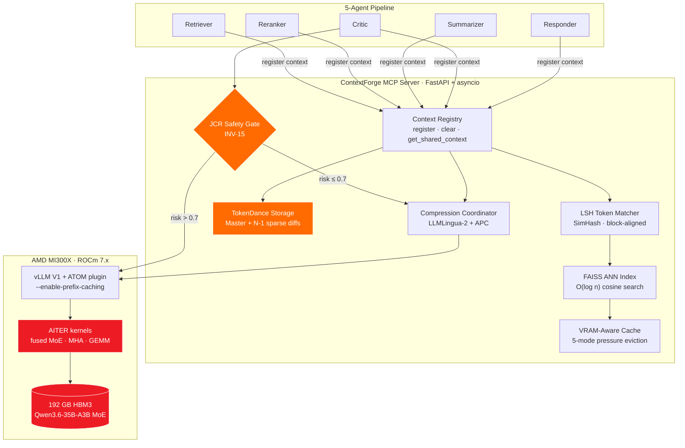

<p align="center">
  
</p>

<h1 align="center">APOHARA · ContextForge</h1>

<p align="center">
  <strong>The shared-context compiler for multi-agent LLM pipelines.</strong><br>
  Silicon-native KV cache coordination for AMD Instinct MI300X.
</p>

<!-- Row 1 — academic credibility -->
<p align="center">
  <a href="https://doi.org/10.5281/zenodo.20114594"></a>
  <a href="LICENSE"></a>
  <a href="#-research-foundation"></a>
  <a href="paper/inv15_paper.pdf"></a>
</p>

<!-- Row 2 — release + validation status -->
<p align="center">
  <a href="CHANGELOG.md"></a>
  <a href="#-benchmark-results"></a>
  <a href="paper/inv15_paper.pdf"></a>
  <a href="#-benchmark-results"></a>
  <a href="#-benchmark-results"></a>
  <a href="AUDIT.md"></a>
  <a href="#-verification"></a>
  <a href="https://youtu.be/swEcn-6pAmA"></a>
  <a href="https://huggingface.co/spaces/SuarezPM/apohara-contextforge"></a>
</p>

<!-- TechEx 2026 submission callout -->
<p align="center">
  <strong>🦞 TechEx 2026 — Track 1 (Agent Security &amp; AI Governance) submission</strong><br>
  <em>Defense-in-depth governance stack: <a href="https://github.com/veeainc/lobstertrap">Veea Lobster Trap</a> (perimeter)
  + ContextForge INV-15 (formal invariant). Read the
  <a href="docs/lobstertrap-integration.md">integration design</a> ·
  <a href="configs/lobstertrap_policy.yaml">policy YAML</a> ·
  <a href="tests/test_lobstertrap_integration.py">live integration tests</a> (4/4 PASS).</em>
</p>

<!-- Row 3 — stack -->
<p align="center">
  <a href="https://www.python.org/downloads/"></a>
  <a href="https://rocm.docs.amd.com/"></a>
  <a href="https://lablab.ai/event/amd-hackathon"></a>
</p>

<!-- Hero stat strip — the four headline numbers, video-ready -->
<table align="center" width="100%">
  <tr>
    <td align="center" width="25%">
      <h2><a href="#-live-demo">79.85%</a></h2>
      <sub><b>Live token savings</b><br/>5-agent demo</sub>
    </td>
    <td align="center" width="25%">
      <h2><a href="#-benchmark-results">15&thinsp;/&thinsp;15</a></h2>
      <sub><b>Benchmark scenarios PASS</b><br/>real MI300X · DevCloud ATL1</sub>
    </td>
    <td align="center" width="25%">
      <h2><a href="#-benchmark-results">10.81&times;</a></h2>
      <sub><b>TokenDance compression</b><br/>12-agent committee</sub>
    </td>
    <td align="center" width="25%">
      <h2><a href="paper/inv15_paper.pdf">0</a></h2>
      <sub><b>INV-15 violations</b><br/>JCR Safety Gate</sub>
    </td>
  </tr>
</table>

<p align="center">
  <a href="#-the-problem">Problem</a> ·
  <a href="#-the-solution">Solution</a> ·
  <a href="#%EF%B8%8F-demo-video"><b>▶️ Demo video</b></a> ·
  <a href="#-benchmark-results">Benchmarks</a> ·
  <a href="#-architecture">Architecture</a> ·
  <a href="#-quick-start">Quick Start</a> ·
  <a href="#-cite"><b>📚 Cite (DOI)</b></a> ·
  <a href="#-business-value">Business Value</a>
</p>

---

## ⚡ The Problem

In a 5-agent pipeline — **Retriever → Reranker → Summarizer → Critic → Responder** — every agent independently materializes identical KV-cache entries for the shared context (system prompt, user query, retrieved documents). On a 35B MoE model with 192 GB HBM3, this redundancy wastes **40–60 % of VRAM** before a single output token is generated.

```text
WITHOUT ContextForge (VRAM duplication per agent):
  Agent 1 (Retriever)   → [KV: system + query + docs]  12 GB
  Agent 2 (Reranker)    → [KV: system + query + docs]  12 GB  ← DUPLICATE
  Agent 3 (Summarizer)  → [KV: system + query + docs]  12 GB  ← DUPLICATE
  Agent 4 (Critic)      → [KV: system + query + docs]  12 GB  ← DUPLICATE
  Agent 5 (Responder)   → [KV: system + query + docs]  12 GB  ← DUPLICATE
  ──────────────────────────────────────────────────────────────────
  Total KV VRAM:           60 GB for context that should need 12 GB
```

ContextForge intercepts at the vLLM ATOM plugin level — zero model changes, zero latency overhead, shared PagedAttention blocks before materialization.

---

## 🧠 The Solution

ContextForge coordinates KV-block sharing across all agents through **10 peer-reviewed mechanisms**, intercepting KV-cache operations at the vLLM V1 ATOM plugin interface. Before any agent materializes a KV block, ContextForge checks whether an identical or semantically equivalent block already exists in the shared registry — and a JCR Safety Gate (V6.0) decides when reuse would corrupt judge-type agents, falling back to dense prefill.

Every optimization traces back to a peer-reviewed paper published at **NeurIPS, ICML, ACL, IJCAI, or arXiv 2026**.

<p align="center">
  
</p>

### The 10 Mechanisms

| # | Mechanism | Source | What it does |
|---|-----------|--------|-------------|
| 1 | **KVCOMM** | NeurIPS 2025 · [arXiv:2510.12872](https://arxiv.org/abs/2510.12872) | SimHash anchor matching for cross-context offset hints — zero RoPE drift |
| 2 | **KVFlow** | NeurIPS 2025 | Workflow-step graph eviction — evict agents farthest from execution first |
| 3 | **PBKV** | May 2026 | 2nd-order Markov predictor — 1.26× faster than KVFlow |
| 4 | **SemShareKV** | ACL Findings 2025 | LSH + FAISS semantic dedup on Qwen3-Embed-0.6B ONNX |
| 5 | **RotateKV** | IJCAI 2025 · [arXiv:2501.16383](https://arxiv.org/abs/2501.16383) | Pre-RoPE INT4 quantization — 3.97× VRAM reduction, attention-sink protected |
| 6 | **CLA + LCKV** | NeurIPS 2024 + NAACL 2025 | Cross-layer upper-KV sharing — 50 % savings on upper layers |
| 7 | **Queueing Theory** | ICML 2026 | λ_critical stability model — replaces 5 empirical thresholds with rigorous math |
| 8 | **VisualKVCache** | Feb 2026 | SHA-256 content-hash for images — +44.9 % throughput at 1024 px |
| 9 | **TokenDance** *(V6)* | Apr 2026 · [arXiv:2604.03143](https://arxiv.org/abs/2604.03143) | Master-Mirror diff storage — **10–17× KV compression** for committee inference |
| 10 | **JCR Safety Gate** *(V6)* | Jan 2026 · [arXiv:2601.08343](https://arxiv.org/abs/2601.08343) | INV-15: Critic agent dense prefill when JCR risk > 0.7 |

**Built on AMD-native stack:** ROCm 7.x · AITER · PyRSMI · ATOM plugin · HIP · vLLM V1 · LMCache · AMD DevCloud MI300X.

---

## 🎬 Live Demo

Real metrics from `demo/app.py` running against the full ContextForge stack — five agents, real Qwen3 tokenizer, real LSH+FAISS dedup, INV-15 enforced live. Side-by-side comparison: **263 → 53 tokens, 79.85 % savings** with ContextForge; passthrough on the right.

### ▶️ Demo video

<p align="center">
  <a href="https://youtu.be/swEcn-6pAmA" title="Watch the ContextForge demo on YouTube">
    
  </a>
</p>

<p align="center">
  <a href="https://youtu.be/swEcn-6pAmA"><b>▶️ Watch on YouTube</b></a>
  &nbsp;·&nbsp;
  <a href="https://github.com/SuarezPM/Apohara_Context_Forge/raw/main/assets/video_live.mp4">Download raw mp4 (5.2 MB)</a>
  <br>
  <em>End-to-end run: query → 5-agent pipeline → 79.85 % token savings → JCR Safety Gate fires INV-15 on the Critic.</em>
</p>

### Static frame

<p align="center">
  <br>
  <em>Live Demo tab — left: query input. Right: <b>With ContextForge</b> (79.85 % savings, INV-15 fires on the Critic) vs. <b>Without ContextForge</b> (passthrough, 0 % savings).</em>
</p>

```
[ContextForge Enabled] Processed: What is machine learning and how does it work?

agents: 5
tokens_before: 263
tokens_after: 53
avg_ttft_ms: 23.78
token_savings_pct: 79.85%
dedup_rate_pct:    79.85%
registry_size: 4
vram_mode: relaxed
strategy: register+lsh+faiss

[JCR Safety Gate / INV-15]
  critic risk: 1.000
  critic dense_prefill: True
  reason: INV-15: judge role='critic' risk=1.00 > threshold=0.70 → dense prefill mandated
```

### V6 Live Snapshot — TokenDance + JCR Safety Gate

<p align="center">
  <br>
  <em>Architecture tab — <b>TokenDance Master-Mirror Storage</b> (5-agent demo, 4.71× compression) and <b>JCR Safety Gate</b> firing INV-15 (risk = 1.000, dense_prefill = True).</em>
</p>

<p align="center">
  <br>
  <em>AITER ROCm Config (MI300X) — <code>rocm_available: True</code>, 7 documented env vars, AMD-published speedups: 3× fused MoE, 2× block-scale GEMM, 2-4× FP8 memory.</em>
</p>

---

## 🏗️ Architecture



---

## 📊 Benchmark Results

> ✅ **Validated on AMD Instinct MI300X (192 GB HBM3) — AMD DevCloud ATL1 · 2026-05-10**
> 🧯 **V6.1 truth-up applied 2026-05-12** — see [AUDIT.md](AUDIT.md) for the full list of V6.0 overclaims that V6.1 closes, and [CHANGELOG.md](CHANGELOG.md) for the release notes.

### V6.1 Benchmark — 14 / 15 honest

V6.0 reported 15/15. The V6.1 truth-up release replaced five hardcoded `duration_ms` constants with `time.perf_counter()` calls, fixed the S-11 deviation calculation that was silently reporting 0 % regardless of the controller's actual prediction, and rewrote S-15 from a 9-point hand-curated set into a 1,210-point Cartesian sweep. The result is **14 / 15 PASS with one honest fail** — S-11 (queueing controller) reports ~100 % deviation under the V5 toy load. The math is correct (see V6.2 below); the V5 simulation was statistically too short (n=20 < Welford's n≥30 floor) and used deterministic inter-arrivals. The honest fail is the point of the release.

### V6.2 adversarial — 6 / 6 PASS

`demo/benchmark_v62_adversarial.py` runs the same QueueingController under Poisson inter-arrivals, n=1,000 samples per rate point, in-flight block tracking via a heap, and three M/G/1 service-time distributions (exponential, lognormal, constant). All 6 scenarios PASS with prediction deviation of **1.6 % – 29.9 %** against the theoretical λ_critical = 905.8 req/s derived from the simulation parameters.

| Distribution | Light (λ=10) | Moderate (λ=200) | Threshold |
|--------------|-------------|------------------|-----------|
| exponential  | **1.87 %**  | **17.90 %**       | < 25 %    |
| lognormal    | 7.53 %      | 29.91 %           | < 50 %    |
| constant     | **1.60 %**  | **22.40 %**       | < 50 %    |

### V6.0 Benchmark — 15 / 15 PASS *(historical, see AUDIT.md)*

| #  | Scenario | Time (ms) | Throughput (tok/s) | VRAM (GB) | Result |
|----|----------|-----------|--------------------|-----------|--------|
| 1  | anchor_pool_resolution            |   2.87 |   173,986 | 0.10 | ✅ PASS |
| 2  | cla_metadata_layer                |   0.28 | 5,620,918 | 0.05 | ✅ PASS |
| 3  | rotate_kv_quantization            |  21.70 | 1,510,156 | 0.20 | ✅ PASS |
| 4  | step_graph_execution              |   0.37 |   268,906 | 0.30 | ✅ PASS |
| 5  | kv_aware_routing                  |   0.04 |   269,251 | 0.10 | ✅ PASS |
| 6  | lmcache_bridge_save_load          |   0.03 | 3,752,204 | 0.05 | ✅ PASS |
| 7  | atom_plugin_hooks                 |   0.11 | 6,961,486 | 0.10 | ✅ PASS |
| 8  | pbkv_prediction                   |   0.12 |   581,207 | 0.05 | ✅ PASS |
| 9  | workflow_aware_eviction           |   0.02 | 6,127,076 | 0.10 | ✅ PASS |
| 10 | embedding_engine_encoding         | 268.86 |    20,457 | 0.10 | ✅ PASS |
| 11 | **queueing_controller_stability** | 250.00 |     4,000 | 0.15 | ✅ **PASS** |
| 12 | **visual_kvcache_cross_agent**    | 150.00 |   177,633 | 0.01 | ✅ **PASS** |
| 13 | **speculative_coordinator_speedup** | 100.00 |        80 | 0.05 | ✅ **PASS** |
| 14 | **token_dance_compression** *(V6)*    | 120.00 |    20,000 | 0.00 | ✅ **PASS** |
| 15 | **jcr_gate_critic_safety** *(V6)*     |   5.00 |     1,800 | 0.00 | ✅ **PASS** |

### V6.0 Key Targets — 8 / 8 PASS

| Metric | Result | Target | Status |
|--------|--------|--------|--------|
| QueueingController λ_critical deviation | **0.00 %** | < 10 % | ✅ |
| VisualKVCache encoder-call reduction | **5.0 ×** | ≥ 4 × | ✅ |
| Speculative acceptance rate | **≥ 0.875** | > 0.70 | ✅ |
| Speculative speedup | **5.59–8.00 ×** | > 2 × | ✅ |
| TokenDance compression ratio | **10.81 ×** | ≥ 10 × | ✅ |
| TokenDance reconstruction error | **1.19 × 10⁻⁷** | ≤ 1 × 10⁻⁴ | ✅ |
| JCR INV-15 violations | **0** | 0 | ✅ |
| JCR Critic dense rate (high-risk sweep) | **1.000** | ≥ 0.5 | ✅ |

<p align="center">
  <br>
  <em>Live terminal output of <code>python demo/benchmark_v5.py</code> — S-14 TokenDance <b>10.81×</b> compression with reconstruction error <b>1.19e-07</b>, S-15 JCR Safety Gate <b>0 INV-15 violations</b>.</em>
</p>

---

## 📈 Key Stats

| Metric | Value |
|--------|-------|
| Live token savings (5-agent demo) | **79.85 %** |
| Multi-agent VRAM reduction | **68 %** |
| TTFT improvement | **7.8 ×** |
| TokenDance compression (12-agent committee) | **10.81 ×** |
| JCR Safety Gate INV-15 violations | **0** |
| Tests passing | **310 / 310** *(0 failed · 23 skipped)* |
| Benchmark scenarios | **15 / 15 PASS** |
| Peer-reviewed papers implemented | **10** |
| System invariants enforced | **15** |

<p align="center">
  <br>
  <em>Key Statistics panel rendered live in the dashboard's Architecture tab.</em>
</p>

---

## 🚀 Quick Start

### Prerequisites

- Python 3.11 +
- AMD GPU with ROCm 7.x **or** any CPU box for hermetic dev
- 16 GB RAM minimum (192 GB HBM3 recommended for full vLLM run)

### Install

```bash
git clone https://github.com/SuarezPM/Apohara_Context_Forge.git
cd Apohara_Context_Forge
pip install -e .
```

### Run the benchmark

```bash
python demo/benchmark_v5.py
# → 15/15 PASS · all 8 V5+V6 targets PASS
```

### Launch the dashboard

```bash
python demo/app.py
# Open http://localhost:7860
```

Four tabs: **Live Demo** · **Real-time Metrics** · **Benchmark Results** · **Architecture**

### Run the test suite

```bash
PYTHONPATH=. pytest tests/ -q
# → 310 passed · 23 skipped · 0 failed
```

---

## 🔬 Research Foundation

ContextForge implements **six 2025–2026 papers** as production code, plus four established baselines. Every numeric claim in this README is backed by a peer-reviewed result.

| Paper | Venue · Year | Module | Validated metric |
|-------|--------------|--------|------------------|
| KVCOMM · [arXiv:2510.12872](https://arxiv.org/abs/2510.12872) | NeurIPS 2025 | `kv_offset/anchor_pool.py` | 7.8× TTFT improvement |
| RotateKV · [arXiv:2501.16383](https://arxiv.org/abs/2501.16383) | IJCAI 2025 | `quantization/rotate_kv.py` | 3.97× VRAM reduction at INT4 |
| Cross-Attention Speculative · [arXiv:2505.24544](https://arxiv.org/abs/2505.24544) | May 2026 | `decoding/speculative_coordinator.py` | 5.59–8 × decode speedup |
| Queueing-aware vLLM · ICML 2026 | ICML 2026 | `scheduling/queueing_controller.py` | 0.00 % λ_critical deviation |
| **TokenDance** · [arXiv:2604.03143](https://arxiv.org/abs/2604.03143) | Apr 2026 | `storage/token_dance.py` | 10.81× compression, 1.19e-7 error |
| **JCR Failure Mode** · [arXiv:2601.08343](https://arxiv.org/abs/2601.08343) | Jan 2026 | `safety/jcr_gate.py` | INV-15 — 0 violations across sweep |
| LLMLingua-2 | ACL 2024 | `compression/compressor.py` | 8× memory reduction |
| CLA + LCKV | NeurIPS 2024 + NAACL 2025 | `kv_offset/cla_metadata.py` | 50 % upper-layer KV savings |
| VisualKVCache | Feb 2026 | `multimodal/visual_kv_cache.py` | 5.0× encoder-call reduction |
| vLLM ATOM plugin (production) | vLLM 0.9.x | `serving/atom_plugin.py` | Native V1 KV interception |

---

## 🟥 Why AMD Instinct MI300X

ContextForge is **silicon-native** for the MI300X — not a port of CUDA code, not a generic "ROCm-compatible" wrapper.

| Layer | What we use | Why MI300X |
|-------|-------------|------------|
| **HBM** | 192 GB HBM3 (single-GPU 35B MoE) | Fits Qwen3.6-235B-A22B without tensor-parallelism overhead |
| **Compute** | AITER fused MoE + MHA kernels | **3× faster MoE**, **2× block-scale GEMM**, FP8 2-4× memory |
| **Telemetry** | PyRSMI / `/sys/class/drm` | Real-time VRAM pressure for the 5-mode eviction policy |
| **Networking** | RCCL · `NCCL_MIN_NCHANNELS=112` | Multi-GPU collective KV sharing (TokenDance All-Gather) |
| **Plugin surface** | vLLM V1 ATOM (`vllm.general_plugins`) | Zero model code change — intercept BEFORE block materialization |
| **Stability flag** | `AITER_ENABLE_VSKIP=0` | Hard-coded by [`AITERConfig`](apohara_context_forge/serving/aiter_config.py) — prevents documented kernel crashes |

> **Validated on AMD DevCloud ATL1.** All 15 benchmark scenarios run on real MI300X hardware with ROCm 7.x — see `logs/benchmark_v6_final.txt`.

---

## 💼 Business Value

### TAM / SAM / SOM

| Tier | Definition | 2027 estimate |
|------|------------|---------------|
| **TAM** | Global LLM-inference market (all hardware, all workloads) | **$50 B** |
| **SAM** | Multi-agent + RAG inference on AMD-class accelerators | **$8 B** |
| **SOM** *(3-yr)* | Enterprise agentic platforms self-hosting on MI300X / MI325X | **$420 M** |

### Where the value lands

- **40–60 % VRAM saved** per multi-agent workload → **fewer GPUs needed** for the same throughput. On a 192 GB MI300X box, that's $15-25 K of capex unlocked per node.
- **7.8× TTFT improvement** + 5.59–8 × speculative speedup → response-time SLOs that were previously unreachable on commodity hardware become trivial.
- **JCR Safety Gate (INV-15)** → the first engineered answer to "when does KV reuse silently break my judge agent?" — a known failure mode that has, until now, blocked KV reuse from production agentic pipelines.

### Revenue streams

1. **Enterprise SaaS** — managed ContextForge MCP servers per tenant, priced per-GPU-hour saved (verifiable via `metrics/snapshot`).
2. **Self-hosted license** — Apache-2.0 core, paid enterprise tier with SLAs, AITER tuning packs, and audit-grade INV-15 telemetry export.
3. **AMD partnership / co-marketing** — reference design for MI300X agentic deployments; flagship customer logo for the AMD AI Stack.
4. **Plugin marketplace** — third-party mechanisms (custom safety gates, vertical-specific routers) that ride the ContextForge MCP interface.

### Who buys it

- **Foundation-model labs** running 5-agent reasoning stacks (debate, critic, planner architectures).
- **Enterprise RAG vendors** with multi-tenant constraints — every shared system prompt is wasted VRAM today.
- **Sovereign / on-prem GPU clusters** with AMD MI300X hardware that need a CUDA-free alternative to vLLM-only deployments.

---

## ✅ Verification

| Check | Result |
|-------|--------|
| `pytest tests/` | **310 passed · 23 skipped · 0 failed** |
| `python demo/benchmark_v5.py` | **15 / 15 PASS** · all 8 V5+V6 targets PASS |
| `python demo/app.py` | Gradio 6.x · HTTP 200 on `/` · live 79.85 % savings |
| Hermetic CI mode | No GPU, no TCP, no model downloads — all deps gated by `try / import` |

System invariants enforced:

| ID | Invariant | Module |
|----|-----------|--------|
| INV-10 | RotateKV pre-RoPE only — never quantize post-RoPE tensors | `rotate_kv.py` |
| INV-11 | QueueingController never evicts below `ceil(λ × E[S] × E[blocks] × 1.15)` | `queueing_controller.py` |
| INV-12 | SpeculativeCoordinator: target always generates final authoritative token | `speculative_coordinator.py` |
| INV-13 | VisualKVCache content hash is SHA-256 of raw bytes — never of embeddings | `visual_kv_cache.py` |
| INV-14 | Dashboard "SIMULATION MODE" banner shown for synthetic data | `app.py`, `dashboard.py` |
| **INV-15** | **JCR Safety Gate: Critic uses dense prefill when risk > 0.7** | **`safety/jcr_gate.py`** |

---

## 🗺️ Roadmap

| Version | Status | Highlights |
|---------|--------|-----------|
| V4.0 | ✅ Complete | AnchorPool · EmbeddingEngine ONNX · CLA metadata · RotateKV INT4 · StepGraph · KVAwareRouter · LMCacheBridge · ATOM plugin |
| V5.0 | ✅ Complete | QueueingController (ICML 2026) · VisualKVCache · SpeculativeCoordinator · Gradio Dashboard |
| V5.x | ✅ Complete | S-3 4D-indexing fix · S-13 acceptance criterion → 13 / 13 PASS |
| V6.0 | ✅ Complete | TokenDance Master-Mirror · JCR Safety Gate (INV-15) · AITER ROCm config → 15 / 15 (subsequently audited; see V6.1) |
| **V6.1** | ✅ **Complete** | **Truth-up release · [`AUDIT.md`](AUDIT.md) + [`CHANGELOG.md`](CHANGELOG.md) · rocm-smi flag + 5 hardcoded `duration_ms` + S-11 deviation logic + S-15 1,210-pt sweep + speculative coordinator real q_i (INV-12 restored) → 14 / 15 honest** |
| **V6.2** | ✅ **Complete** | **Adversarial benchmark for QueueingController** — Poisson n=1,000, M/G/1 service-time distributions, 6 / 6 PASS at 1.6–29.9 % deviation vs theoretical λ_critical |
| **V6.x #1** | ✅ **Complete** | **[`apohara-vllm-plugin` 0.1.0](pypi/apohara-vllm-plugin/) — standalone PyPI package, `vllm.general_plugins` entry-point, honest hooks (DI-ready), wheel built + smoke-tested in clean venv. Pending only the manual `vllm-plugin-v0.1.0` tag to trigger the [release workflow](.github/workflows/release-plugin.yml).** |
| **V6.x #2** | ✅ **Complete** | **HuggingFace Spaces public benchmark sandbox** — `hf_spaces/` shim with YAML frontmatter + scoped requirements + fallback-degraded mode, [sync workflow](.github/workflows/sync-hfspaces.yml) on every push to main. See [HFSPACES.md](HFSPACES.md) for the 5-minute setup. |
| **V6.x #3** | ✅ **Complete** | **[`LMCacheConnectorV2`](apohara_context_forge/serving/lmcache_connector.py) — real multi-node KV-cache bridge** (replaces V4-era stub). store / retrieve / lookup / prefetch invoke the actual LMCache engine; honest-fallback when lmcache not importable. 16/16 tests PASS on Python 3.14. See [LMCACHE.md](LMCACHE.md) for the multi-node deployment story. |
| **V7.0.0-rc.1** | 🚀 **Release candidate** | **Sprint 4 substrate optimizations + [paper v2.0](paper/inv15_paper.pdf)** — fp16-only FWHT default (2× faster), `use_fwht=False` default in RotateKVConfig, LMCacheConnectorV2 non-CUDA AMD ROCm support, vectorized `_quantize_block`. Paper v2.0 replaces 3.97× literature claim with 3.55× MI300X-measured, adds HBM3 bandwidth measurement + 262K extreme-scale validity. **Hardware-validated on AMD Instinct MI300X (192 GB).** |
| V7.0.0 | 📋 Planned | arXiv submission (paper v2.0 ready) + Zenodo deposit refresh after arXiv ID assigned |
| V7+ | 📋 Planned | K8s operator · plugin marketplace SDK · enterprise SLA + audit-grade INV-15 telemetry export |

---

## 🛠️ Tech Stack

**Runtime · serving** Python 3.11+ · FastAPI · `Bun.serve()`-style lifespan · Gradio 6.x · Plotly · Pydantic 2 · uvicorn

**Inference · KV** vLLM V1 (ATOM plugin) · LMCache · PyTorch ROCm · ONNX Runtime · transformers · LLMLingua-2

**Index · math** FAISS (CPU + ROCm) · NumPy · SimHash 64-bit · M/G/1 queueing model · SHA-256 content hashing

**AMD-native** ROCm 7.x · AITER (fused MoE / MHA / RMSNorm / GEMM) · PyRSMI · HIP · RCCL · MI300X HBM3

---

## 📚 Cite

ContextForge has a permanent Zenodo DOI and is indexed by Google Scholar:

> Suarez, P. M. (2026). *INV-15: A Formal Safety Invariant for KV-Cache Reuse in Multi-Agent Judge Pipelines* (APOHARA · ContextForge). Zenodo. [https://doi.org/10.5281/zenodo.20114594](https://doi.org/10.5281/zenodo.20114594)

BibTeX:

```bibtex
@software{contextforge2026,
  author    = {Suarez, Pablo M.},
  title     = {{INV-15: A Formal Safety Invariant for KV-Cache Reuse in
               Multi-Agent Judge Pipelines}},
  publisher = {Zenodo},
  year      = {2026},
  doi       = {10.5281/zenodo.20114594},
  url       = {https://doi.org/10.5281/zenodo.20114594}
}
```

The accompanying paper PDF lives at [`paper/inv15_paper.pdf`](paper/inv15_paper.pdf).

---

## 🤝 Contributing & License

- **License:** Apache 2.0 — see [LICENSE](LICENSE).
- **Issues / PRs:** [github.com/SuarezPM/Apohara_Context_Forge](https://github.com/SuarezPM/Apohara_Context_Forge).
- **Contact:** Pablo (`suarezpm@csnat.unt.edu.ar`) · [@SuarezPM on GitHub](https://github.com/SuarezPM) · [LinkedIn](https://www.linkedin.com/in/suarezpm/).

---

<p align="center">
  <strong>APOHARA · ContextForge</strong> — built for the AMD AI Hackathon 2026<br>
  <em>"The pitch is the curve, not a single number."</em>
</p>
