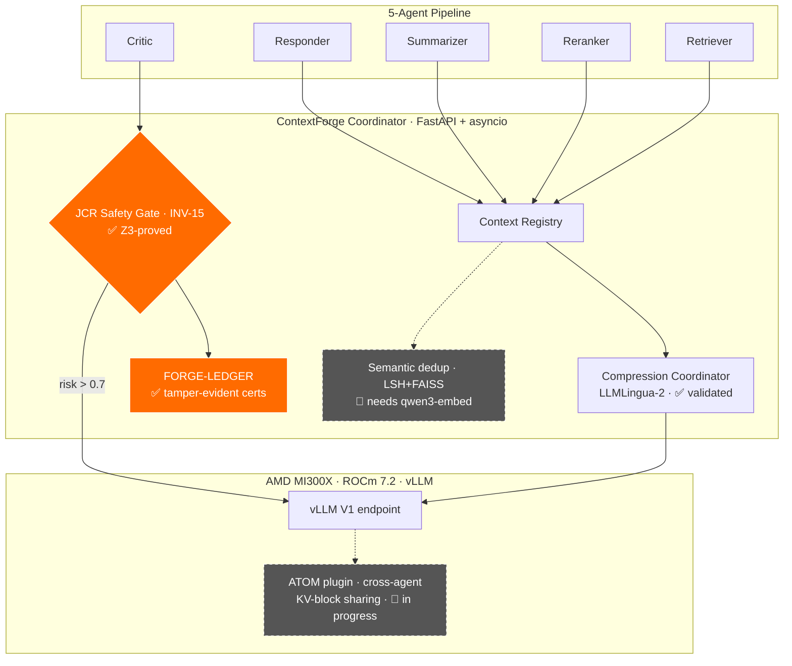

<p align="center">
  
</p>

<h1 align="center">APOHARA&nbsp;·&nbsp;ContextForge</h1>

<p align="center">
  <strong>A formally-verified KV-cache safety &amp; coordination layer for multi-agent LLM pipelines.</strong><br>
  AMD Instinct MI300X-native. Built around one provable guarantee — and honest about the rest.
</p>

<p align="center">
  <a href="https://doi.org/10.5281/zenodo.20277875"></a>
  <a href="LICENSE"></a>
  <a href="#-whats-real-validated-on-mi300x"></a>
  <a href="paper/inv15_paper.pdf"></a>
  <a href="AUDIT.md"></a>
  <a href="#-verification"></a>
  <a href="https://www.python.org/"></a>
</p>

<p align="center">
  <a href="#-the-problem">Problem</a> ·
  <a href="#-whats-real-validated-on-mi300x"><b>What's real</b></a> ·
  <a href="#-architecture">Architecture</a> ·
  <a href="#-quick-start">Quick start</a> ·
  <a href="#-honesty--audit"><b>Honesty</b></a> ·
  <a href="#-roadmap">Roadmap</a> ·
  <a href="#-cite">Cite</a>
</p>

---

## TL;DR

Multi-agent LLM pipelines (retriever → reranker → summarizer → **critic** → responder) share a long common context. Reusing the KV-cache across agents is the obvious win — **except for judge-type agents**, where reuse silently corrupts the verdict (the *Judge Candidate Reuse* failure mode). ContextForge is the coordination layer that makes shared-context multi-agent inference **safe and efficient on a single AMD MI300X**:

- **🛡️ Safety (the proven core).** `INV-15` — a formal invariant requiring judge-class agents to use dense prefill when KV-reuse risk crosses a threshold — enforced by the **JCR Safety Gate**, **machine-checked by a Z3 SMT proof**, and recorded in a **tamper-evident, hash-chained certified ledger** (FORGE-LEDGER).
- **✂️ Efficiency (validated).** LLMLingua-2 prompt compression → **44 % fewer prompt tokens** on real frontier-MoE inference; INT4 RotateKV KV-codec → **3.55× VRAM reduction**, measured on MI300X.
- **🧩 Coordination (in progress).** Cross-agent KV-block sharing inside vLLM — the path to large VRAM savings — is under active construction (see [Roadmap](#-roadmap)). We report what is measured today and label the rest honestly.

> **Why this repo is different:** every headline number below traces to a committed log on real MI300X hardware, and every gap is documented in [`AUDIT.md`](AUDIT.md). The pitch is the curve and the discipline — not a single inflated number.

---

## ⚡ The Problem

In a 5-agent pipeline, each agent re-encodes the same shared context (system prompt + query + retrieved docs). Naïve cross-agent KV-cache reuse removes that redundancy — but **breaks judge agents**: when the Critic compares candidates `{c₁…cₖ}`, attention cached from a prior ranking encodes the old ordering and biases the new verdict. The failure is **silent** — accuracy on non-judge tasks looks unchanged ([Liang et al., 2026](https://arxiv.org/abs/2601.08343)).

No production KV-coordination system had a *contract* for when reuse is safe. **That contract is `INV-15`, and it is what ContextForge proves.**

---

## ✅ What's real — validated on MI300X

> Hardware: 1× **AMD Instinct MI300X** (192 GB HBM3, ROCm 7.2). vLLM in Docker; coordinator host-side. Raw artifacts in [`logs_mi300x_p2/`](logs_mi300x_p2/) and [`logs_moe_run/`](logs_moe_run/) — see the [evidence report](logs_moe_run/MI300X_MOE_EVIDENCE.md).

### 🛡️ Safety — the formally-verified core

| Property | Result | Evidence |
|---|---|---|
| INV-15 violations over full **1,210-point** input sweep | **0 / 1,210** | `logs_mi300x_p2/mi300x_p2_forge_ledger.json` |
| Z3 SMT proof of INV-15 (negation `unsat` over modeled domain) | **PROVED**, 10.08 ms | `safety/z3_inv15_proof.py` |
| FORGE-LEDGER: hash-chained certified decisions + tamper test | **verify exit 0** · tamper → **exit 2** (`broken_at` reported) | `observability/ledger.py` |
| Per-decision Z3 cert latency (p99) | **0.25 ms** · 243 certs/s | on-hardware |
| Critic dense-prefill rate over its risk subspace | **0.851** | matches the paper |

### ✂️ Efficiency — measured

| Metric | Result | Notes |
|---|---|---|
| **ContextForge prompt compression, live MoE** | **44.4 %** fewer prompt tokens (5 265 → 2 926) | LLMLingua-2, 5-agent workload, real inference |
| INT4 RotateKV KV-codec reduction | **3.55×** (constant 4K → 262K ctx) | length-invariant; `use_fwht=False` (FWHT degrades MSE ~200×) |
| HBM3 effective bandwidth | **3.79 TB/s** (72 % of 5.3 peak) | STREAM-triad fp16 |

### 🚀 Frontier MoE on a single MI300X (vLLM)

| Model | Params | Quant | Single-card | Long context (NIAH) | Throughput |
|---|---|---|---|---|---|
| **Qwen3-30B-A3B-2507** | 30B / 3B MoE | FP8 | ✅ ~186 GB | **12/12 → 174K tok** | 2 667 tok/s |
| **Qwen3-Coder-Next** (hybrid) | 80B / 3B MoE | FP8 | ✅ ~175 GiB *(vLLM 0.19)* | **12/12 → 174K tok** | 2 149 tok/s |
| **Qwen3-235B-A22B** | 235B / 22B MoE | **INT4** (GPTQ) | ✅ ~181 GiB | — | (INT4 decode) |

> The 192 GB HBM3 lets a single MI300X hold frontier MoE that an 80 GB card cannot. FP8 235B (≈221 GB) needs >1 card; **INT4 fits one card** — that's the memory moat, with our own measured footprints.

---

## 🏗️ Architecture



✅ = validated on MI300X · 🔬 = in progress (see [Roadmap](#-roadmap)).

---

## 🧩 Mechanisms & honest status

ContextForge implements ideas from recent KV-cache literature. We grade each by **what we have actually verified**, not by what the source paper claims:

| Mechanism | Source | Status |
|---|---|---|
| **JCR Safety Gate (INV-15)** | [arXiv:2601.08343](https://arxiv.org/abs/2601.08343) | ✅ **Validated + Z3-proved** on MI300X |
| **RotateKV INT4 codec** | [arXiv:2501.16383](https://arxiv.org/abs/2501.16383) | ✅ **Validated** — 3.55× (not the 3.97× literature figure; see AUDIT) |
| **LLMLingua-2 compression** | ACL 2024 | ✅ **Validated** — 44 % on live MoE *(fixed a bug that left it non-functional; see AUDIT)* |
| **FORGE-LEDGER** (certified audit) | this work | ✅ **Validated** on-hardware |
| TokenDance committee compression | [arXiv:2604.03143](https://arxiv.org/abs/2604.03143) | 🟡 Component-tested (synthetic), not yet on a live model |
| KVCOMM · KVFlow · PBKV · CLA · VisualKVCache · Queueing controller | various | 🟡 Implemented + unit-tested (synthetic inputs) |
| **Cross-agent KV-block sharing** (ATOM plugin) | — | 🔬 **In progress** — the plugin computes reuse/gate decisions; physical block sharing inside vLLM is being built |
| Semantic dedup on `qwen3-embed` ONNX | ACL Findings 2025 | 🔬 Falls back to pseudo-embeddings until `qwen3-embed` is installed |
| LMCache multi-node KV bridge | 2025 | 🔬 Needs the ROCm LMCache build |

---

## 🚀 Quick Start

```bash
git clone https://github.com/SuarezPM/Apohara_Context_Forge.git
cd Apohara_Context_Forge
pip install -e .            # or: uv sync

# Run the test suite (hermetic — no GPU / no downloads required)
PYTHONPATH=. pytest tests/ -q        # → 441 passed · 25 skipped

# Reproduce the INV-15 formal proof
python -m apohara_context_forge.safety.z3_inv15_proof
# → {"status": "PROVED", "elapsed_ms": 10.08, "z3_version": "4.16.0"}

# Verify a certified ledger
python -m apohara_context_forge.observability.ledger_cli verify <ledger.jsonl>

# Local 5-agent dashboard (context compression demo)
python demo/app.py        # http://localhost:7860
```

To reproduce the MI300X evidence, see [`scripts/forge_p2_run_all.sh`](scripts/forge_p2_run_all.sh) and [`scripts/mi300x_contextforge_e2e.py`](scripts/mi300x_contextforge_e2e.py).

---

## 🔎 Honesty &amp; Audit

This project keeps a **public accountability layer**. [`AUDIT.md`](AUDIT.md) lists every claim that was once overstated, with `file:line` evidence and its fix; [`scripts/check_honesty.sh`](scripts/check_honesty.sh) runs in CI to catch hardcoded benchmark numbers and misleading labels. Recent corrections tracked there include: the codec figure (3.97× literature → **3.55× measured**), the compressor bug (loaded LLMLingua-2 but ran the LLMLingua-1 path → never compressed; **now fixed**), and the distinction between the local demo and real-model inference.

State must match what the code does at runtime. When it didn't, it's in the audit.

---

## ✅ Verification

| Check | Result |
|---|---|
| `PYTHONPATH=. pytest tests/` | **441 passed · 25 skipped · 0 failed** |
| `z3_inv15_proof` | **PROVED** (`unsat` on negation) |
| `ledger_cli verify` (intact / tampered) | exit **0** / **2** |
| Honesty CI guard | **PASS** |

**System invariants enforced:** INV-10 (RotateKV pre-RoPE only) · INV-11 (queue floor) · INV-12 (speculative authoritative token) · INV-13 (visual hash of raw bytes) · INV-14 (simulation-mode banner) · **INV-15 (JCR dense-prefill — Z3-proved)**.

---

## 🗺️ Roadmap

**Now — close the efficiency moat (the honest gap):**
- 🔬 **Real cross-agent KV-block sharing in vLLM** (ATOM plugin) — turn the reuse *decisions* the plugin already computes into physical PagedAttention block sharing across agents. This is what backs end-to-end VRAM savings; it is **not yet built**, and the README will quote VRAM numbers only once it is measured.
- 🔬 **Install `qwen3-embed`** so semantic dedup runs on real embeddings (today it degrades to pseudo-embeddings).
- 🔬 **Needle-in-a-haystack under INT4** at 200K — prove the compressed context is still correctly attended.

**Next — safety & audit depth (the differentiator):** adaptive INV-15 thresholds · Z3 extended to INV-10…INV-14 · OTLP audit export for compliance.

**Later — scale & ecosystem:** multi-GPU TokenDance over RCCL · LMCache ROCm build · K8s operator hardening · companion paper on the MoE + coordination evidence.

Full history in [`CHANGELOG.md`](CHANGELOG.md).

---

## 💼 Who it's for

ContextForge targets teams running **multi-agent / LLM-as-judge pipelines on-prem on AMD MI300X** who need their AI safety controls to be **provable and auditable** — regulated enterprises (model-risk, defense, healthcare) and AI-safety/eval teams. The JCR Safety Gate + certified ledger are the engineered, audit-grade answer to *"when does KV reuse silently break my judge agent?"*

---

## 📚 Cite

> Suarez, P. M. (2026). *INV-15: A Formal Safety Invariant for KV-Cache Reuse in Multi-Agent Judge Pipelines* (APOHARA · ContextForge). Zenodo. https://doi.org/10.5281/zenodo.20277875

```bibtex
@software{contextforge2026,
  author    = {Suarez, Pablo M.},
  title     = {{INV-15: A Formal Safety Invariant for KV-Cache Reuse in Multi-Agent Judge Pipelines}},
  publisher = {Zenodo}, year = {2026},
  doi       = {10.5281/zenodo.20277875}
}
```

Paper: [`paper/inv15_paper.pdf`](paper/inv15_paper.pdf).

---

## 🤝 License &amp; contact

Apache 2.0 — see [LICENSE](LICENSE). · Pablo M. Suarez · [`suarezpm@csnat.unt.edu.ar`](mailto:suarezpm@csnat.unt.edu.ar) · [@SuarezPM](https://github.com/SuarezPM)

<p align="center"><sub><strong>APOHARA · ContextForge</strong> — built for AMD Instinct MI300X · honest by construction.</sub></p>
