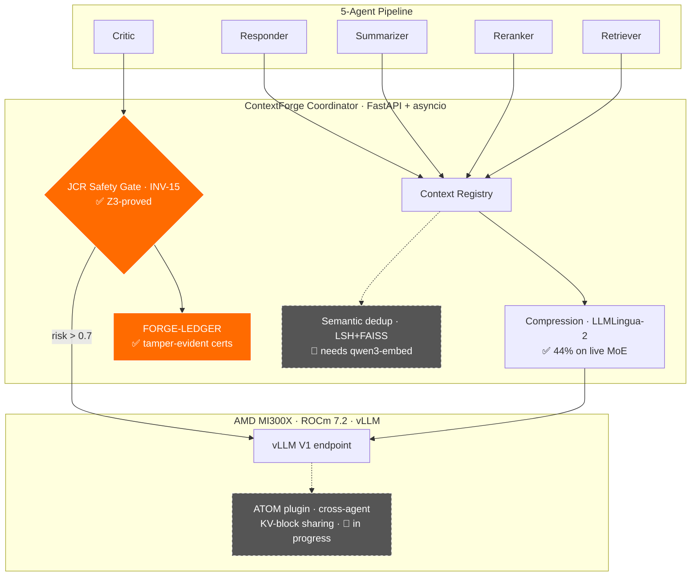

<p align="center">
  
</p>

<h1 align="center">APOHARA&nbsp;·&nbsp;ContextForge</h1>

<p align="center">
  <strong>The first formally-verified safety layer for multi-agent LLM pipelines.</strong><br>
  Share the KV-cache to make agents affordable — <em>without</em> silently corrupting your judges.<br>
  AMD Instinct MI300X-native. Machine-checked by Z3. Honest by construction.
</p>

<p align="center">
  <a href="https://doi.org/10.5281/zenodo.20277875"></a>
  <a href="LICENSE"></a>
  <a href="#-proof-not-promises"></a>
  <a href="paper/inv15_paper.pdf"></a>
  <a href="AUDIT.md"></a>
  <a href="#-verification"></a>
</p>

<p align="center">
  <a href="#-the-50-billion-problem-hiding-in-your-agents">The problem</a> ·
  <a href="#-proof-not-promises"><b>Proof</b></a> ·
  <a href="#-architecture">Architecture</a> ·
  <a href="#-quick-start">Quick start</a> ·
  <a href="#-who-needs-this">Who needs it</a> ·
  <a href="#-honest-by-construction"><b>Honesty</b></a> ·
  <a href="#-roadmap">Roadmap</a>
</p>

---

## 🎯 The $50-billion problem hiding in your agents

Multi-agent LLM systems — retriever → reranker → summarizer → **critic** → responder — are how serious AI gets built in 2026. Every agent re-reads the same long context, so the obvious way to make them affordable is to **share the KV-cache** across agents.

**Except it quietly breaks the one agent you trust most: the judge.** When your Critic compares candidates, reused attention from a prior ranking encodes the *old* ordering and biases the new verdict. Accuracy on everything else looks fine — so the corruption is **invisible** ([Liang et al., 2026](https://arxiv.org/abs/2601.08343)). Until now, no production system could tell you *when* reuse is safe. So teams either burn GPU re-computing everything, or ship judges that lie.

**ContextForge is the layer that proves the answer** — and runs frontier models a single AMD MI300X can hold but an 80 GB card cannot.

---

## 💡 What you get

| | |
|---|---|
| 🛡️ **A guarantee, not a heuristic** | `INV-15`: judge-class agents fall back to dense prefill when KV-reuse risk crosses threshold — **machine-checked by a Z3 SMT proof**, with **zero violations across all 1,210 input points**, and a **tamper-evident certified ledger** of every decision. The first formal safety contract for cross-agent KV reuse. |
| ✂️ **Real efficiency, measured on silicon** | **44 % fewer prompt tokens** on live frontier-MoE inference (LLMLingua-2) · **3.55× KV-cache VRAM reduction** at INT4 (RotateKV), constant from 4K to 262K context. |
| 🚀 **The 192 GB memory moat** | Three frontier MoE models served on **one MI300X** — including an 80B hybrid-attention MoE and a 235B at INT4 — with **needle-in-a-haystack recall to 174K tokens**. Footprints we measured ourselves. |
| 🔍 **Radical transparency** | Every number traces to a committed log on real hardware. We even publish [`AUDIT.md`](AUDIT.md) — our own ledger of past overclaims and their fixes. In a field drowning in inflated benchmarks, that *is* the differentiator. |

---

## 🔬 Proof, not promises

> 1× **AMD Instinct MI300X** (192 GB HBM3, ROCm 7.2). vLLM in Docker; coordinator host-side. Raw artifacts in [`logs_mi300x_p2/`](logs_mi300x_p2/) + [`logs_moe_run/`](logs_moe_run/), summarized in the [evidence report](logs_moe_run/MI300X_MOE_EVIDENCE.md).

### 🛡️ The safety core — formally verified

| Property | Result |
|---|---|
| INV-15 violations across the full **1,210-point** input sweep | **0 / 1,210** |
| Z3 SMT proof of INV-15 (negation `unsat` over the modeled domain) | **PROVED** · 10.08 ms |
| FORGE-LEDGER: hash-chained certified decisions + live tamper test | **verify → exit 0** · tamper → **exit 2** |
| Per-decision Z3 certification latency (p99) | **0.25 ms** · 243 certs/s |

### ✂️ The efficiency — measured, not modeled

| Metric | Result |
|---|---|
| **ContextForge prompt compression on live MoE** | **44.4 %** fewer prompt tokens (5 265 → 2 926), 5-agent workload |
| INT4 RotateKV KV-cache reduction | **3.55×**, length-invariant 4K → 262K (`use_fwht=False`) |
| HBM3 effective bandwidth | **3.79 TB/s** (72 % of peak), STREAM-triad fp16 |

### 🚀 Frontier MoE on a single card

| Model | Params | Precision | One MI300X | Long-context recall |
|---|---|---|---|---|
| **Qwen3-30B-A3B-2507** | 30B / 3B MoE | FP8 | ✅ ~186 GB | **NIAH 12/12 → 174K tok** · 2 667 tok/s |
| **Qwen3-Coder-Next** (hybrid) | 80B / 3B MoE | FP8 | ✅ ~175 GiB | **NIAH 12/12 → 174K tok** · 2 149 tok/s |
| **Qwen3-235B-A22B** | 235B / 22B MoE | INT4 | ✅ ~181 GiB | served single-card |

> An 80 GB GPU cannot hold these. A 192 GB MI300X can. That gap is the moat — and these are *our* measured footprints, not a datasheet.

---

## 🏗️ Architecture



✅ validated on MI300X · 🔬 in progress — and we tell you which is which.

---

## 🧩 Every mechanism, graded by what we actually verified

We refuse to claim a paper's number as our own. Each mechanism is graded by **what runs and what we measured**:

| Mechanism | Source | Status |
|---|---|---|
| **JCR Safety Gate (INV-15)** | [arXiv:2601.08343](https://arxiv.org/abs/2601.08343) | ✅ **Validated + Z3-proved** |
| **RotateKV INT4 codec** | [arXiv:2501.16383](https://arxiv.org/abs/2501.16383) | ✅ **Validated** — 3.55× |
| **LLMLingua-2 compression** | ACL 2024 | ✅ **Validated** — 44 % on live MoE |
| **FORGE-LEDGER** certified audit | this work | ✅ **Validated** on-hardware |
| TokenDance · KVCOMM · KVFlow · PBKV · CLA · VisualKVCache · Queueing | various | 🟡 Implemented + unit-tested (synthetic) |
| **Cross-agent KV-block sharing** (ATOM) | — | 🔬 **In progress** — the moat we're building next |
| Semantic dedup on `qwen3-embed` · LMCache ROCm bridge | various | 🔬 In progress |

---

## 🚀 Quick Start

```bash
git clone https://github.com/SuarezPM/Apohara_Context_Forge.git
cd Apohara_Context_Forge && pip install -e .        # or: uv sync

PYTHONPATH=. pytest tests/ -q                        # 441 passed · 25 skipped

python -m apohara_context_forge.safety.z3_inv15_proof
# → {"status": "PROVED", "elapsed_ms": 10.08, "z3_version": "4.16.0"}

python -m apohara_context_forge.observability.ledger_cli verify <ledger.jsonl>
python demo/app.py                                   # local dashboard @ :7860
```

MI300X reproduction: [`scripts/forge_p2_run_all.sh`](scripts/forge_p2_run_all.sh) · [`scripts/mi300x_contextforge_e2e.py`](scripts/mi300x_contextforge_e2e.py).

---

## 🏢 Who needs this

You don't ship LLM-as-judge to production on a hunch — and regulators won't let you. ContextForge is built for teams running **multi-agent / judge pipelines on-prem on AMD MI300X** who must **prove** their AI is safe:

- **Banks** (SR 11-7 model risk) · **defense** (DFARS / CMMC) · **healthcare** (HIPAA) · any team under the **EU AI Act**'s high-risk audit obligations — source code and data that legally cannot leave the VPC, on hardware that fits frontier MoE single-card.
- **AI-safety & eval teams** whose entire product is a judge pipeline — exactly where the JCR failure mode bites.

The JCR Safety Gate + certified ledger are the **audit-grade, machine-checked answer** to *"prove your judge agent isn't silently wrong."* Nobody else ships that.

---

## 🔍 Honest by construction

Most AI repos inflate. We do the opposite — on purpose, because trust is the product. [`AUDIT.md`](AUDIT.md) is our **public ledger of every claim we ever overstated**, with `file:line` evidence and its fix; [`scripts/check_honesty.sh`](scripts/check_honesty.sh) runs in CI to catch hardcoded numbers and misleading labels. Recent entries: the codec figure (literature 3.97× → **measured 3.55×**), a compressor bug that left compression non-functional until we fixed it, and the line between our local demo and real-model inference.

If a number is here, it ran on real silicon and there's a log to prove it. If it isn't built yet, we mark it 🔬.

---

## ✅ Verification

| Check | Result |
|---|---|
| `PYTHONPATH=. pytest tests/` | **441 passed · 25 skipped · 0 failed** |
| `z3_inv15_proof` | **PROVED** (`unsat` on negation) |
| `ledger_cli verify` (intact / tampered) | exit **0** / **2** |
| Honesty CI guard | **PASS** |

**Invariants enforced:** INV-10…INV-14 + **INV-15 (JCR dense-prefill — Z3-proved)**.

---

## 🗺️ Roadmap

**Now — building the efficiency moat (and we'll quote VRAM only once it's measured):**
🔬 Physical cross-agent KV-block sharing inside vLLM (ATOM plugin) · 🔬 real-embedding semantic dedup (`qwen3-embed`) · 🔬 needle-in-a-haystack under INT4 at 200K.

**Next — safety & audit depth (the differentiator):** adaptive INV-15 thresholds · Z3 extended to INV-10…INV-14 · OTLP compliance export.

**Later — scale:** multi-GPU TokenDance over RCCL · LMCache ROCm build · K8s operator hardening · companion systems paper. Full history in [`CHANGELOG.md`](CHANGELOG.md).

---

## 📚 Cite

> Suarez, P. M. (2026). *INV-15: A Formal Safety Invariant for KV-Cache Reuse in Multi-Agent Judge Pipelines* (APOHARA · ContextForge). Zenodo. https://doi.org/10.5281/zenodo.20277875

```bibtex
@software{contextforge2026,
  author = {Suarez, Pablo M.},
  title  = {{INV-15: A Formal Safety Invariant for KV-Cache Reuse in Multi-Agent Judge Pipelines}},
  publisher = {Zenodo}, year = {2026}, doi = {10.5281/zenodo.20277875}
}
```

Paper: [`paper/inv15_paper.pdf`](paper/inv15_paper.pdf) · Apache 2.0 ([LICENSE](LICENSE)) · Pablo M. Suarez · [`suarezpm@csnat.unt.edu.ar`](mailto:suarezpm@csnat.unt.edu.ar) · [@SuarezPM](https://github.com/SuarezPM)

<p align="center"><sub><strong>APOHARA · ContextForge</strong> — provably-safe multi-agent inference on AMD Instinct MI300X.</sub></p>
